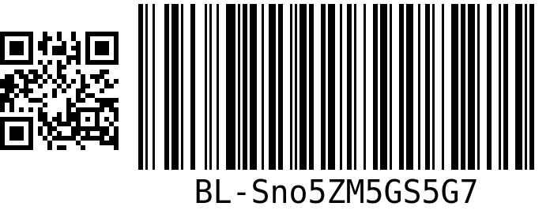

# bl-id-generator

With `bl-id-generator` you can:

- [use a cli for simplicity](#cli)
- [generate unique IDs](#generate-unique-ids)
- [print out IDs on labels](#print-out-ids-on-labels)
- [create PNG files of IDs](#create-png-files-of-ids)

# CLI

The cli is very simple but lets you do all the commands from the terminal. Use
`ts-node` to run the file `id-generator-cli.ts` which is located in the root
folder of this repo.

```bash
ts-node ./id-generator-cli.ts print 10 2
# where 10 is the number of IDs and 2 is the number of Labels for each ID
# tries to print X number of IDs with a brother_ql printer

ts-node ./id-generator-cli.ts png 10 ./output/
# where 10 is the number of IDs and ./output/ is the output location for the files
# creates PNG files that will be located in the specified location

ts-node ./id-generator-cli.ts generate 10
# where 10 is the number of IDs generated
# returns a list of IDs

ts-node ./id-generator-cli.ts
ts-node ./id-generator-cli.ts --help
# no arguments or with '--help' prints out information about how to use the cli
```

# Generate unique IDs

We call the unique id at boklisten for `BLID` or simply `boklisten id`. The id
is composed of 12 random characters from an array of 62 (a-z, A-Z and 0-9).
This gives an extremly low probability of creating two equals. If you have
already created 1 million unique IDs the chance of creating one which is equal
is: `3 in 100 quadrillion.`

The IDs will look like:

```text
2wkO7CoKbtHH
u8W1aiUnitEp
```

### Simple to generate IDs

```typescript
import { idGenerator } from "bl-id-generator";

const id = idGenerator.generate(); // returns one unique ID
const ids = idGenerator.generate(100); // returns an array of 100 unique IDS
```

# Print out IDs on labels

The IDs can be printed out as labels. To see what they will look like, [please read more about them](#how-the-labels-look)

### Dependencies

- [brother ql](https://github.com/pklaus/brother_ql)

This repo uses `brother_ql` to print out the IDs in form of labels. When
printing labels you must have it installed.

- Linux Ubuntu:
  - When a printer is connected the printer is located under `/dev/usb/lb1` or
    `/dev/usb/lp0` This file is by default only accessible with ROOT. You must
    therefore create access to this file for example with `chmod ugo+rwx /dev/usb/lp1`
  - read more about connection to the printer by [reading broter ql's documentation](https://github.com/pklaus/brother_ql#backends)

> important: printing only works with `brother_ql` compatible printers. As of now it has only been tested with `Brother QL-700`

### Simple to print IDs

```typescript
import { idGenerator } from "bl-id-generator";

idGenerator
  .print(10, 2)
  .then(() => {
    console.log("printed 10 ids with 2 labels each");
  })
  .catch(error => {
    console.log("There was an error printing labels", error);
  });
```

### Supported label ratios

- 62
  - Brother White Paper tape
- 62x29
  - Brother Small address label
- 29x90
  - Brother Standard address label

# Create PNG files of IDs

When you just want to create PNG files and not print out labels you can do so easily.

If you want to know what the label includes and looks like please [read more
about them](#how-the-labels-look)

### Simple to create PNGs

```typescript
import { idGenerator } from "bl-id-generator";

idGenerator
  .createPNG(10)
  .then(() => {
    console.log("created 10 PNG files in folder /output");
  })
  .catch(error => {
    console.log("there was an error creating the PNG files", error);
  });
```

When doing so the PNG files will be put in a folder (default: ./output). You
can then use the outputted images to do whatever, print out on a printer of
your choice or store the images on a server.

# How the labels look



The printed image consists of a QR code and a barcode. Both the QR and the
barcode includes the same code. In this instance the code is `Sno5ZM5GS5G7`.
If you scan with a QR scanner or a barcode scanner you will get the same code.

> important: the `BL-` part of the printed text is only there for ease of use,
> it is NOT part of the code

Read more:

- Info about [Barcode](https://en.wikipedia.org/wiki/Barcode)
  - barcode generator which is used in this repo: [JsBarcode](https://github.com/lindell/JsBarcode)
- Info about [QR code](https://en.wikipedia.org/wiki/QR_code)
  - qr code generator which is uded in this repo: [node-qrcode](https://github.com/soldair/node-qrcode)

# Develompent

We use these packages:

- [node-qrcode](https://github.com/soldair/node-qrcode)
  - generates qr codes
- [JsBarcode](https://github.com/lindell/JsBarcode)
  - generates barcodes
- [Canvas](https://github.com/Automattic/node-canvas)
  - HTML Canvas implementation for NodeJS
- Packages used for development:
  - [AVA](https://github.com/avajs/ava)
    - for testing
  - [Prettier](https://prettier.io/)
    - for code formatting
  - [ts-node](https://github.com/TypeStrong/ts-node)
    - for running the typescript code without compiling to JS
  - [typescript](https://typescriptlang.org)
    - the language this repo is using

# Settings

To edit sizes of the labels, margin and padding between qrcode and barcode you can do so in the settings file.

```typescript
type IdGeneratorSettings = {
  printer: {
    model: "QL-700";
    location: string;
  };
  dimension: "62" | "62x29" | "29x90";
  dimensions: {
    [dimensionId: string]: {
      label: {
        height: number; //label height in px
        width: number; // label width in px
        margin: number; // label margin in px
        spaceBetween: number; // space between qrcode and barcode in px
      };
      qrcode: {
        height: number;
        width: number;
        scale: number; // the scale of the qr code, 2 is small 18 is large
        margin: number;
        paddingTop: number;
      };
      barcode: {
        height: number;
        width: number;
        fontSize: number;
        barcodeWidth: number; // the width of each bar in the barcode
        barcodeHeight: number; // the height of each bar in the barcode
        margin: number;
        marginBottom: number;
      };
    };
  };
};
```

You can edit the default settings by calling `setSettings`:

```typescript
import { idGenerator } from "bl-id-generator";

idGenerator.setSettings({
  dimension: "62x29",
  printer: {...},
  dimensions: {
      "62x29": {...}
    }
  });

```
